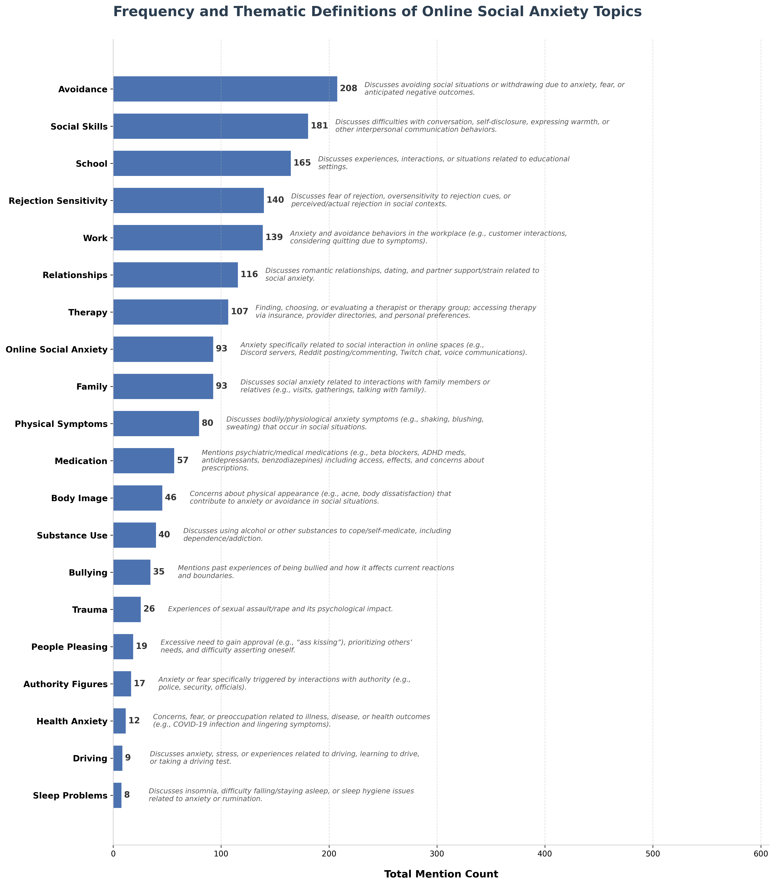
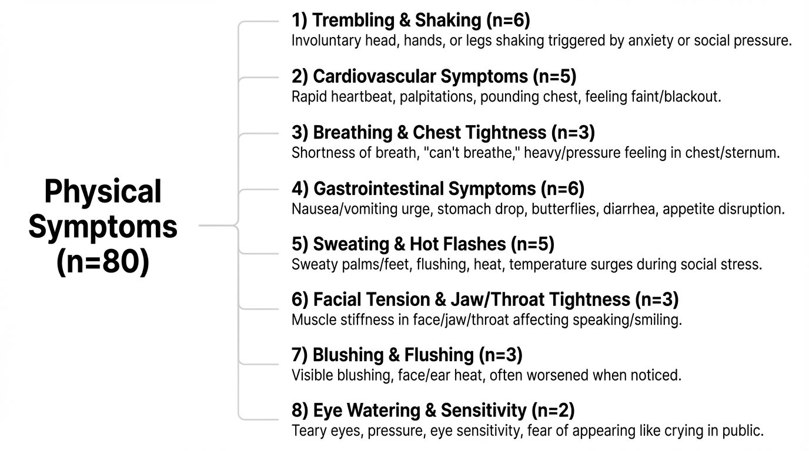

# Topic Modeling of the r/socialanxiety Subreddit

This project compares three topic modeling approaches: Latent Dirichlet Allocation (LDA), BERTopic, and TopicGPT. They are applied to 27,197 posts and 238,589 comments from the r/socialanxiety subreddit collected between March 1, 2019 and March 1, 2021 using the Pushshift Reddit archive.

The goal of the project is to evaluate how different topic modeling approaches identify themes within large-scale social media discussions of mental health. This time period was chosen because it matched the data analyzed from a [research article](https://link.springer.com/10.1007/s12144-024-05891-z) which served as a reference for initial outputs using LDA.

The methods represent three different modeling approaches:

- **LDA**: probabilistic topic modeling based on word co-occurrence  
- **BERTopic**: embedding-based topic modeling using transformer document representations  
- **TopicGPT**: prompt-based topic generation and assignment using large language models  

The models were implemented using Python and compared based on their ability to identify both broad themes and smaller subtopics within the dataset.
# Key Findings

- LDA successfully identified broad themes such as school, work, treatment, and social interactions but showed variability across runs due to stochastic training.
- BERTopic produced similar results regarding broad topics and allowed the discovery of smaller subthemes such as rumination, suicidal ideation, and cannabis use discussions.
- TopicGPT generated hierarchical topic structures including topic labels and descriptions and was particularly effective at identifying physical symptoms of social anxiety.
- Overall, BERTopic provided the best balance of interpretability, computational efficiency, and ability to explore smaller subthemes within the dataset.

# Full Project Writeup

A more detailed description of topic modeling, the dataset, preprocessing pipeline, model implementations, results, and discussion is available [here.](results/report.pdf)

# LDA

The LDA implementation produced coherent topics representing broad themes within the dataset. Common clusters included discussions of school, work, medication, and therapy. However, results varied somewhat between runs due to the stochastic nature of LDA and sensitivity to preprocessing choices. Labels were suggested based off of their most frequent occuring words.

## Topic Table

| Topic | Size (%) | Label | Top Words |
|------|------|------|------|
| 1 | 21 | Time and Family | time, day, year, back, felt, started, bad, home, family, week |
| 2 | 18.4 | Life Struggles | life, make, thought, good, person, change, love, care, find, world |
| 3 | 15.6 | SA Symptoms | anxiety, social, anxious, situation, make, fear, time, sa, interaction, thought |
| 4 | 14.3 | Conversations | talk, talking, conversation, make, person, time, award, dont, weird, question |
| 5 | 7.2 | Relationships | friend, group, year, make, game, talk, school, meet, hang, find |
| 6 | 4.2 | Treatment | therapy, anxiety, therapist, medication, doctor, depression, work, med, cbt, mental |
| 7 | 3.7 | School | school, class, teacher, college, presentation, high, grade, year, group, student |
| 8 | 3.5 | Work | job, work, call, interview, phone, working, customer, good, office, money |
| 9 | 3.3 | Physical Symptoms | eye, contact, body, face, make, stop, start, head, smile, gym |
| 10 | 2.6 | Shopping | walk, car, store, walking, food, mask, wear, driving, eat |
| 11 | 2.1 | Dating | girl, guy, woman, date, relationship, dating, drink, girlfriend, crush, boyfriend |
| 12 | 2.1 | Positive Events | good, step, proud, great, music, hope, happy, luck, today, awesome |
| 13 | 2 | Digital Communication | post, online, message, reddit, comment, medium, chat, video, text, posting |

## LDA Visualization

The interactive LDAvis visualization shows the relative size of topics, how closely related they are, and the relative frequency of the most commonly occuring words within each topic.

[lda_vis.webm](https://github.com/user-attachments/assets/29a14d5a-fddf-4dce-a9dc-50bc84dd32eb)

# BERTopic

BERTopic produced results broadly similar to LDA while running significantly faster. Allowing a larger number of clusters enabled the model to identify more specific subthemes within the corpus.

Several notable subthemes included:

- Topic 26 — suicidal thoughts and feelings  
- Topic 59 — rumination and overthinking  

The model also identified multiple clusters related to substance use:

- Topic 16 — alcohol use in social settings  
- Topic 71 and Topic 86 — cannabis and related substances  

Additional insights included differences in the frequency of posts discussing dating posted by men versus women, suggesting that relationship-related concerns may be discussed differently across genders.

BERTopic also provided useful analysis tools including representative documents for each topic and convenient access to all posts within each cluster. A list of all 90 topics found with umap clustering can be found [here.](results/BERTopic/umap_topics.txt)

## Topic Table

| Topic | Size (%) | Label | Top Words |
|------|------|------|------|
| 1 | 12.6 | Miscellaneous | way, things, person, want, say, talk, make, self, life, friends |
| 2 | 12.06 | Life Struggles | life, help, things, going, want, better, work, make, way, day |
| 3 | 11.16 | Relationships | friends, school, want, life, make, talk, friend, things, try, college |
| 4 | 9.48 | Dating | girl, friends, friend, want, talk, say, girls, good, person, make |
| 5 | 9.31 | Social Interactions | say, talk, conversation, talking, person, awkward, try, things, make, way |
| 6 | 7.43 | School | class, school, teacher, presentation, going, good, classes, group, did, say |
| 7 | 6.84 | Work | job, work, interview, phone, jobs, good, got, working, day, make |
| 8 | 6.84 | Digital Communication | post, online, want, media, reddit, chat, friends, play, make, talk |
| 9 | 5.25 | Treatment | therapy, medication, help, therapist, doctor, effects, talking, meds |
| 10 | 5.09 | Eye Contact | look, eye, contact, looking, face, wear, gym, eyes, wearing, make |
| 11 | 4.89 | Purchasing Food | eat, food, going, store, room, didn, eating, got, want, way |
| 12 | 4.56 | Family | family, parents, mom, want, life, help, talk, things, school, dad |
| 13 | 4.49 | Social Events | party, going, birthday, friends, want, alcohol, friend, drink, good |

---

## Topic Visualizations

### 90 Topic Model (UMAP)

[BERTopic_Vis_Umap.webm](https://github.com/user-attachments/assets/f9ce6159-3192-48d4-b22a-c90f9773a409)

### 13 Topic Model (K-means)

[BERTopic_Vis_13.webm](https://github.com/user-attachments/assets/c7e09055-d844-4caf-bcd8-29c2e0b8499a)

# TopicGPT

TopicGPT generated hierarchical topics and subtopics using a prompt based approach with a large language model. Initial runs produced 20 high level topics and approximately 80 subtopics. A subset of 600 documents were analyzed in accordance with author recommendations.

While some generated topics would likely not be considered appropriate for a broad topic, such as anxiety deriving from interactions with authority figures, TopicGPT demonstrated a key advantage in its interpretability due to its generation of topic descriptions. Additionally, it was notably effective at identifying structured subtopics related physical symptoms associated with social anxiety as shown below.

Because TopicGPT relies on large language models, results were sensitive to prompt design and required more computational resources compared to the other approaches.

## Topic Lists

Full topic outputs are available here:

- [TopicGPT Initial Topics](results/TopicGPT/generation_1.txt)
- [TopicGPT Subtopics](results/TopicGPT/generation_2.txt)

## High-Level Topics

## Subtopics: Physical Symptoms

